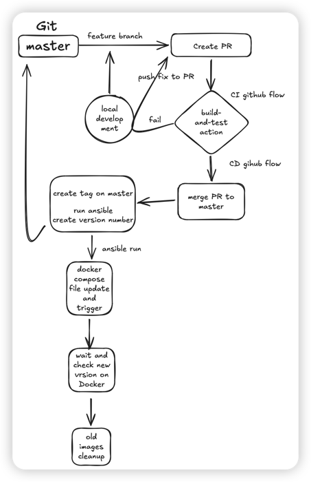

## Payoneer web application CI/CD 

Flow diagram:




### Description:

CI/CD flow for the application is based on GitHub actions and ansible:

GitHub actions folder structure:
```

.github
`-- workflows
    |-- cd-deployment.yaml
    `-- ci-build-test.yaml

```

Ansible folder structure:
```
.infra
`-- ansible
    |-- deploy_app
    |   |-- README.md
    |   |-- defaults
    |   |   `-- main.yml
    |   |-- handlers
    |   |   `-- main.yml
    |   |-- meta
    |   |   `-- main.yml
    |   |-- tasks
    |   |   `-- main.yml
    |   |-- tests
    |   |   |-- inventory
    |   |   `-- test.yml
    |   `-- vars
    |       `-- main.yml
    `-- deployment.yml
```

## CI Process

For the CI process branches with specific names should be used:
  - feature/*
  - hotfix/*
  - chore/*

This done to separat Development porcess where we want to build the application and non build required 
changes on the repository.

CI Steps:

 - create local branch and make your changes
 - update application version in `package.json`
 - create PR from you local branch to master
 - fill in PR information in the description
 - `build-and-test` check based on `CI - Angular App` workflow will run and perform:
    * code quality check - check code quality and code security using SonarQube (see Improvements part, not enabled)
    * npm linter - code linter check (see Improvements part, not enabled)
    * npm test - run tests (see Improvements part, not enabled)
    * npm build - local application build 

CD Steps:

 - validate your PR have all checked passed 
 - validate you PR is approved at least by one reviwer
 - merge PR
 - after PR is merged `CD - Deploy to EC2` workflow wil run with:
    * new tag will be created on `master` branch using version from `package.json` and PR cycle
    * docker image build using version from `package.json` and PR cycle
    * docker push to the docker repository (Docker Hub)
    * run ansible: 
      * update docker-compose file with a new version
      * trigger new image deployemnt
      * wait until deployemnt is done and container is runing
      * test application on port 80
    * cleanup old images from instance


## Improvements:
1. The current CI/CD sycle is a short development cycle where we develope on local 
and only after local tests are passed we assume that we finished, and we deploy our 
application to the Production instance. Thsi flow can be enchanced and improved by
using branch strategy CI/CD cycle.

 - Implement branch strategy using `dev`, `staging`, `release` branches
 - Implement nginx with a reverse proxy for diferent environments using different ports:
   * http://applicaction/dev on port 8081 - corresponding to `dev`
   * http://applicaction/stage on port 8082 - corresponding to `staging`
   * http://applicaction/rc on port 8083 - corresponding to `release`
   * http://application/ on port 80 - corresponding to `production`

This will allow us to run different deployemnts of the same application
using same instance and same Docker and perform different type of test, like 
smoke tsting, sanity tsting, e2e tsting, integration tsting, load testing

2. Code linetr should run and check for any syntax errors, formatting issues

3. As for current project no code quality and test are enabled. In the CI workflow
this part is commneted (not required for this project) but for production grade project it should be enabled.
 - SonarQube is example for code quality tool can be connectd and provide code quality and code security report. 
   We can fail PR progress based on critical rules and send feedback to PR assignee (owner) to take
   and action to fix an issue. This part can run as a part of CI workflow or seted as a stand-alone workflow
   to provide stand-alone check during PR creation.
   Code Quality tools also can provide us a report with a code complexity and code lint.
   (beside the fact that we can use code qaulity tools on local IDE to verfy before we push to branch)
 - Code testing with a unit test written and pushed with a code as a part of CI cycle should run as a pre-build 
   task and post build tasks:
    * pre-buld testing to validate we are not trying to build broken code
    * post build testing - validate post build artifact functioning 
   
4. Roll back procedure in case we have failed deployment


